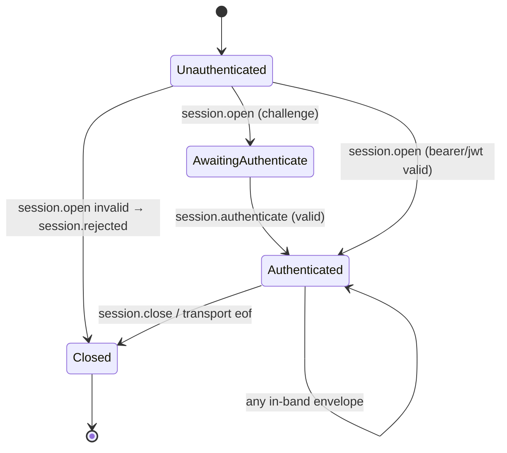
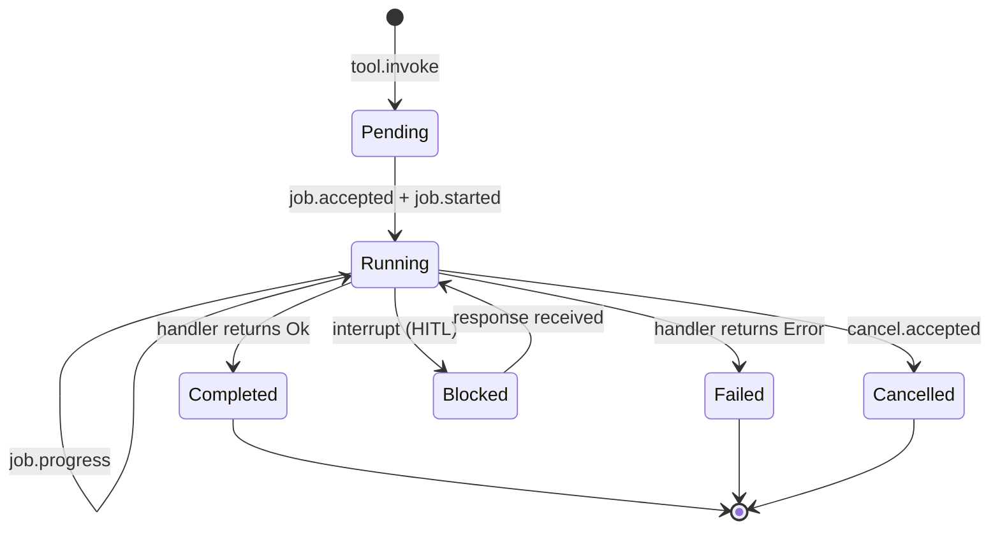
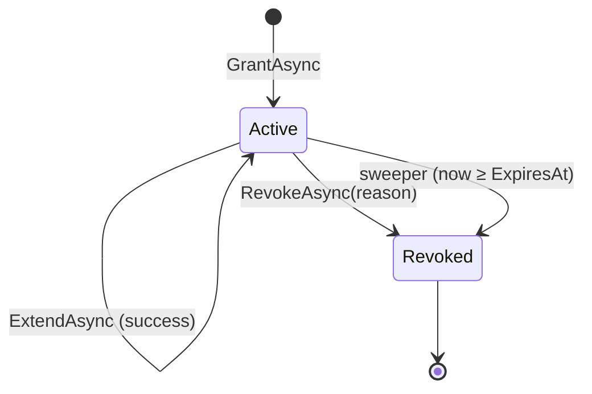

# ARCP F# SDK — Build Plan

This document is the design rationale and phased plan for the F# reference implementation of [ARCP v1.0](./RFC-0001-v2.md). It complements [`README.md`](./README.md) (user docs) and [`CONFORMANCE.md`](./CONFORMANCE.md) (per-section status).

## Goals

1. A **single-binary** F# SDK that implements ARCP end-to-end: session handshake, jobs, streams, subscriptions, leases, artifacts, human-in-the-loop, resume, and the in-memory + stdio + WebSocket transports.
2. **No client routing.** The runtime owns all message dispatch. Application code registers tool handlers and (optionally) auth validators; everything else (id allocation, log persistence, fanout, leases, retries) is the SDK's job.
3. **F# semantics first.** Discriminated unions plus exhaustive pattern matching for the closed message set. Records for state. `task { ... }` over `async { ... }` for .NET interop. Single-case DUs as newtypes for every id.
4. **Cross-runtime ready.** Wire format is canonical JSON via `FSharp.SystemTextJson`; ids are ULIDs; nothing in the public surface is F#-specific.

Non-goals for v0.1: mTLS, OAuth2, scheduled jobs, multi-agent delegation, stream sidecars, HTTP/2 + QUIC. All deferred to v0.2 — see [`CONFORMANCE.md`](./CONFORMANCE.md).

## Phase log

| Phase | Scope | Status |
| --- | --- | --- |
| 0 | Investigation, solution skeleton, plan | done |
| 1 | Envelope, ids, errors, JSON, event log, trace context | done |
| 2 | Session handshake, capability negotiation, auth (bearer/jwt/none) | done |
| 3 | Jobs, streams, cancellation, heartbeats, interrupt | done |
| 4 | Human input/choice, permissions, leases | done |
| 5 | Subscriptions, artifacts, resume | done |
| 6 | Stdio + WebSocket transports | done |
| 7 | CLI, samples, docs, packaging, v0.1.0 tag | done (this commit) |

Each phase had a hard gate: `dotnet fantomas --check && dotnet build -c Release && dotnet test -c Release`. No phase landed until all three were green.

## Architecture: file-order-is-architecture

In F#, a file may only reference types declared in earlier files (in `<Compile Include="…" />` order). We exploit this as a layering check. The order in [`src/ARCP/ARCP.fsproj`](./src/ARCP/ARCP.fsproj) is the canonical dependency-first order:

```
Version.fs                # protocol & SDK version constants
Ids.fs                    # newtypes (SessionId, JobId, …)
Trace.fs                  # W3C trace context
Errors.fs                 # ARCPError DU + helpers
Json.fs                   # FSharp.SystemTextJson configuration
Envelope.fs               # the wire envelope (generic over payload)
Extensions.fs             # well-known x-* extensions
Messages/Session.fs       # session.* payloads
Messages/Control.fs       # cancel/interrupt
Messages/Execution.fs     # tool.invoke/job.*
Messages/Streaming.fs     # stream.*
Messages/Human.fs         # human.*
Messages/Permissions.fs   # permission.*/lease.*
Messages/Subscriptions.fs # subscribe.*
Messages/Artifacts.fs     # artifact.*
Messages/Telemetry.fs     # telemetry.*
Messages/Registry.fs      # the closed MessageType DU
Auth/Auth.fs              # AuthScheme, IAuthValidator
Auth/Bearer.fs            # static-token validator
Auth/Jwt.fs               # HS256 validator
Store/EventLog.fs         # SQLite append-only log + idempotency
Transport/Transport.fs    # ITransport + helpers
Transport/Memory.fs       # paired in-process channels
Transport/Stdio.fs        # NDJSON over TextReader/Writer
Transport/WebSocket.fs    # ws:// + ASP.NET host
Runtime/Pending.fs        # generic pending-response registry
Runtime/Lease.fs          # LeaseManager (grant/extend/revoke/sweep)
Runtime/Stream.fs         # StreamManager, Reader, Writer
Runtime/Job.fs            # JobManager, heartbeat reaper
Runtime/Subscription.fs   # SubscriptionManager (filter + backfill + drain)
Runtime/Artifact.fs       # ArtifactStore
Runtime/Session.fs        # negotiate, state machine type
Runtime/Runtime.fs        # the dispatcher
Client/Handlers.fs        # IHumanInputHandler, IChoiceHandler, IPermissionHandler
Client/Client.fs          # the client driver
```

A new dependency points up the list; a forward reference is a build failure. This is unusually strict for an SDK but it pays off when the protocol grows — new envelope types are added at the canonical spot, not jammed in wherever convenient.

## Message-type table

The closed DU in `Messages/Registry.fs` ensures every match site is exhaustive. The full set (RFC §5):

| Wire `type` | DU case | Group |
| --- | --- | --- |
| `session.open/challenge/authenticate/accepted/rejected/unauthenticated/refresh/evicted/close` | `SessionOpen` … `SessionClose` | RFC §9 |
| `cancel/cancel.accepted/cancel.refused/interrupt` | `Cancel`, `CancelAccepted`, `CancelRefused`, `Interrupt` | RFC §12 |
| `ping/pong` | `Ping`, `Pong` | RFC §10.3 |
| `tool.invoke/error` and `job.accepted/started/progress/completed/failed/cancelled` | `ToolInvoke`, `ToolError`, `JobAccepted` … `JobCancelled` | RFC §10 |
| `stream.open/chunk/end` | `StreamOpen`, `StreamChunk`, `StreamEnd` | RFC §11 |
| `human.input.request/response/cancelled` and `human.choice.request/response` | `HumanInputRequest` … | RFC §14 |
| `permission.request/grant/deny` and `lease.granted/extended/revoked/refresh` | `PermissionRequest` … | RFC §15 |
| `subscribe/subscribe.accepted/event/closed` and `unsubscribe` | `Subscribe`, `SubscribeAccepted` … | RFC §13 |
| `artifact.put/ref/fetch/release` | `ArtifactPut` … | RFC §16 |
| `telemetry.*` | `TelemetryEvent` | RFC §18 |
| `resume` | `Resume` | RFC §19 |
| `nack` | `Nack` | transport-level |

Adding a new wire type means: extend the appropriate `Messages/*.fs` group, add the case to `Messages/Registry.fs`, fix every now-broken match. The compiler is the protocol enforcer.

## State machines

### Session



Implemented as the `SessionState` DU in `Runtime/Session.fs`; the transitions are the `match state with …` arms in `Runtime/Runtime.fs:loop`.

### Job



`JobManager` owns the per-job state. Each job has a heartbeat channel and a missed-deadline reaper; that's how `HEARTBEAT_LOST` is detected for externally-managed jobs (RFC §10.3).

### Lease



The sweeper runs through `TimeProvider.CreateTimer`, so unit tests use `FakeTimeProvider` to advance the clock deterministically.

## Test plan

Three tiers, all required to be green at every phase gate:

1. **Unit tests** (`tests/ARCP.UnitTests/`) — pure functions, serialisation round-trips, FsCheck properties for `Envelope`, `Capabilities`, `negotiate`, error codes.
2. **Integration tests** (`tests/ARCP.IntegrationTests/`) — runtime+client over `Memory.createPair ()`. One file per protocol concern (`HandshakeTests.fs`, `JobLifecycleTests.fs`, `HumanInputTests.fs`, …). The stdio and WebSocket transports each have a dedicated file that re-runs the canonical handshake + invoke over the actual transport.
3. **Sample runs** (Phase 7) — the six `samples/*` projects must each exit 0 against the in-process runtime; this is the "demo passes" gate.

The CLI is exercised by `samples/` and by the README quickstart; it does not have its own test project — failures there surface immediately as the docs script.

## Packaging

The library publishes as **`ARCP.FSharp`** (the F# SDK) and **`ARCP.FSharp.Cli`** (a .NET global tool, `arcp`). Both are built with `dotnet pack -c Release --output ./artifacts` and ship as NuGet packages. The tool installs cleanly via `dotnet tool install --global --add-source ./artifacts ARCP.FSharp.Cli`.

## Risk register / known issues

- **Bounded subscription channel.** Per-subscription delivery uses a bounded channel with a drain pump. If a subscriber is slow, the pump cannot keep up and TryWrite returns false → BACKPRESSURE_OVERFLOW + subscription closed. This is intentional; the alternative (unbounded growth) is worse. Tunable via the `capacity` parameter on `SubscriptionManager.SubscribeAsync`.
- **Stdio transport line size.** No explicit cap; envelopes that exceed the receiver's buffer get split. We rely on .NET's `TextReader.ReadLineAsync` doing the right thing. v0.2 may add a size cap.
- **Resume timing.** The current resume implementation acks after a 250 ms grace period. A future revision will introduce an explicit `resume.accepted/failed` pair (RFC §19 is silent on the ack).
- **WebSocket per-connection runtime.** `arcp serve --ws` allocates a fresh Runtime per connection. That's OK for a developer-mode CLI but a production deployment should share a single Runtime across connections, dispatching per-session.

## What ships in v0.1

- The SDK library, the CLI, the six samples, this PLAN.md, README.md, CONFORMANCE.md, CHANGELOG.md.
- Unit + integration tests for every public API surface area.
- NuGet packages for SDK and CLI.

## What v0.2 unlocks

- §8.2 mTLS + OAuth2 auth.
- §10.6 scheduled jobs.
- §11.3 stream sidecar binary.
- §14.x multi-agent delegation / handoff.
- §15.6 trust elevation.
- §19 checkpoint-id resume.
- §22 HTTP/2 + QUIC transports.
- Production WebSocket server (shared Runtime across connections).

See [`CONFORMANCE.md`](./CONFORMANCE.md) for the authoritative deferred-work list.
