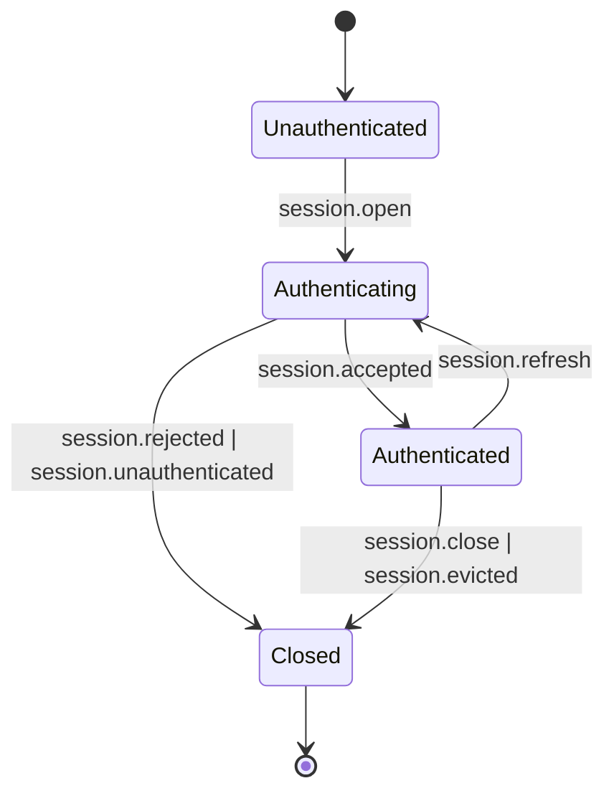
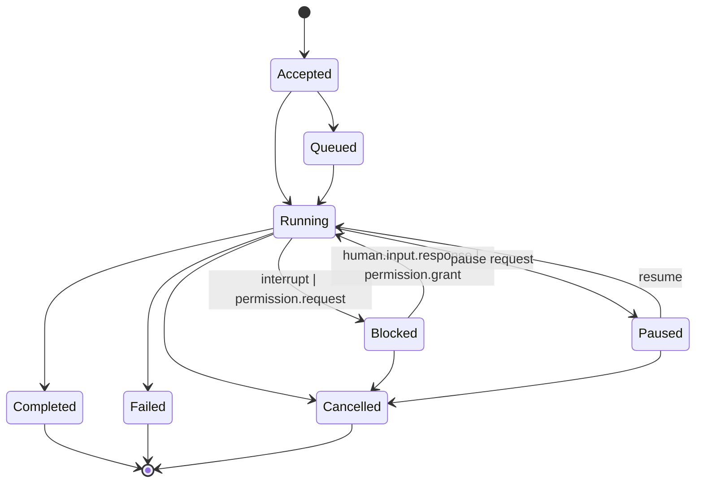
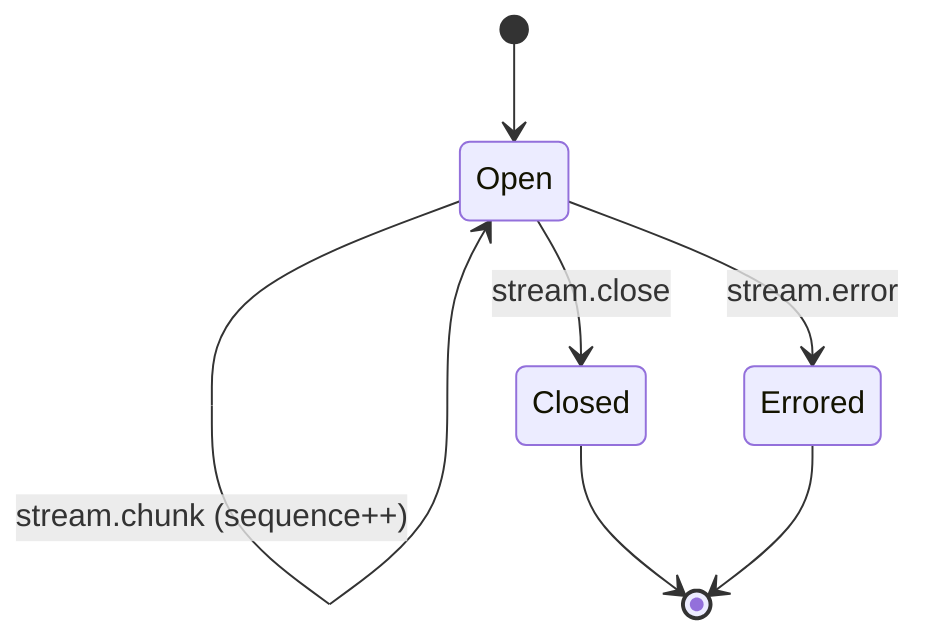
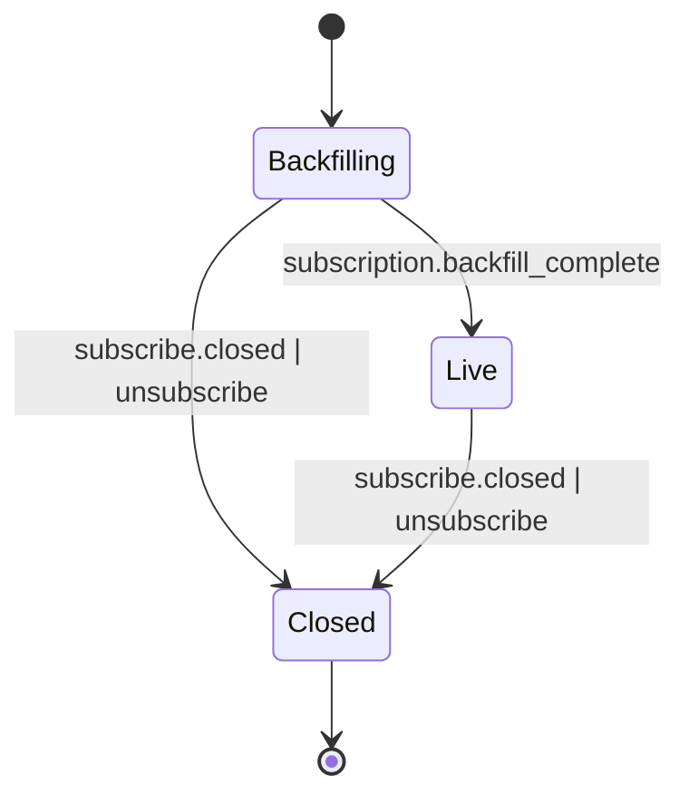
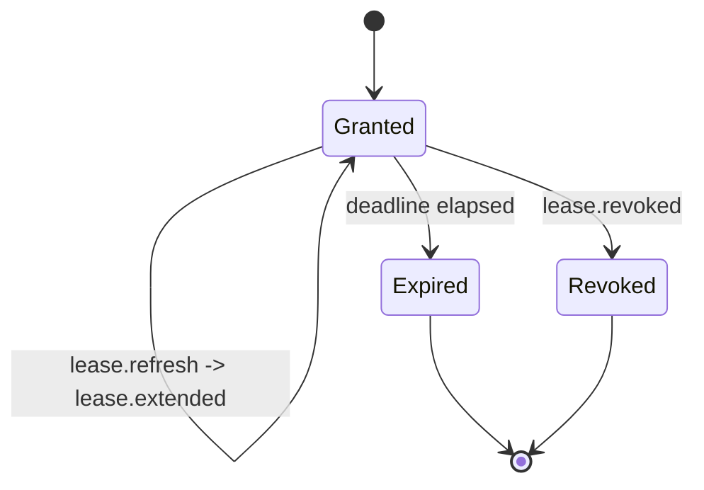

# PLAN.md — ARCP F# SDK v0.1

This is the build plan for the F# reference implementation of ARCP v1.0 as specified in `RFC-0001-v2.md`. It is the canonical artifact produced in Phase 0 of the build prompt and is updated in subsequent phases as understanding shifts.

The plan is opinionated about three things: file order in `ARCP.fsproj`, exhaustive-match dispatch via discriminated unions, and the boundary between `Result<'T,ARCPError>` and exceptions. Everything else flows from those.

---

## 0. Section-by-section RFC reading notes

These are the sections that drive implementation work, with a one-paragraph précis of what each one constrains.

- **§4 Design Principles** establish that the protocol is transport-agnostic, streaming-native, durable, typed, event-driven, authenticated by default, and extensible. v0.1 honors all seven; the only ones partially deferred are durable sessions (§9) and the breadth of mandatory transports (§4.1 lists seven; v0.1 ships WebSocket and stdio per §22).
- **§6.1 Envelope** is the wire shape for every message. The required fields are `arcp`, `id`, `type`, `timestamp`, `payload`; many are conditional (`session_id`, `job_id`, `stream_id`, `subscription_id`); a handful are recommended for tracing (`trace_id`, `span_id`). `correlation_id` and `causation_id` are optional but the runtime must preserve them so clients can rebuild causality. `idempotency_key` is the *logical* idempotency key, distinct from the transport-level `id` (§6.4). `priority` (§6.5) defaults to `normal` and constrains scheduling without ever reordering within a stream/job. `extensions` is the namespaced extension carrier (§21).
- **§6.2 Message Types** enumerates ~50 message types in nine groups. The DU `MessageType` carries one case per type plus an `Extension` case for namespaced unknowns.
- **§6.3 / §6.4 / §6.5** describe the command/result/event flow, dual-id idempotency, and priority semantics. Two consequences for implementation: (a) the `Runtime` must maintain a `(session_principal, idempotency_key)` lookup and replay the prior outcome when a duplicate logical command arrives; (b) priority influences scheduling between streams/jobs but never within a `stream_id` or `job_id`.
- **§7 Capability Negotiation** is a JSON object carried in `session.open` and `session.accepted`. Required-but-unsupported capabilities cause `session.rejected` with `code: UNIMPLEMENTED`. The list `capabilities.extensions` is how extensions opt in (§21.2).
- **§8 Authentication** specifies the four-message handshake and the `bearer | mtls | oauth2 | signed_jwt | none` schemes. v0.1 implements `bearer`, `signed_jwt`, and `none` (the latter only with negotiated `capabilities.anonymous: true`). Re-authentication (§8.4) and eviction (§8.5) are part of the session state machine.
- **§9 Sessions** distinguishes stateless / stateful / durable. v0.1 supports stateless and stateful sessions; durable across reconnects with checkpoint resume is **deferred** to v0.2. v0.1 ships `resume.after_message_id` only.
- **§10 Jobs** is the largest substantive section. The state machine has eight states (§10.2). Heartbeats default to a 30-second interval and `N=2` missed-deadline policy (§10.3), with recovery behavior advertised via `capabilities.heartbeat_recovery`. Cancellation is cooperative with a `deadline_ms` after which the runtime may hard-kill (§10.4). Interrupts (§10.5) transition to `blocked` and emit a `human.input.request`. Scheduled jobs (§10.6) are out of scope for v0.1; the runtime advertises `scheduled_jobs: false` and `nack`s schedule requests.
- **§11 Streaming** defines six kinds (`text`, `binary`, `event`, `log`, `metric`, `thought`); receivers must treat unknown kinds as `event`. Backpressure messages are a first-class signal (§11.2). Binary encoding (§11.3) supports in-envelope base64 and sidecar binary frames; v0.1 implements **base64 only** so the same code paths work over stdio. Reasoning streams (§11.4) carry `role`/`content`/`redacted`.
- **§12 Human-in-the-Loop** has four message types — `human.input.request`, `human.input.response`, `human.choice.request`, `human.choice.response`, plus `human.input.cancelled`. The runtime validates `value` against the request's `response_schema` (JSON Schema). Expiration with default fallback is mandatory.
- **§13 Subscriptions** introduces the observer role: read-only event subscriptions with filters (§13.2) and backfill (§13.3). The boundary between historical and live is signaled by a synthetic `event.emit` of type `subscription.backfill_complete`.
- **§15 Permissions & Leases** is the challenge/grant/lease lifecycle. Permission requests block the requesting job; grants produce leases scoped to (permission, resource, operation, expires_at). Leases support refresh, extension, and revocation. Trust elevation (§15.6) is a special-case permission and is **deferred** to v0.2.
- **§16 Artifacts** are addressable, content-typed payloads. v0.1 implements inline base64 with SQLite-backed storage and a periodic retention sweep. Artifact `uri` form is `arcp://session/<sid>/artifact/<aid>`.
- **§17 Observability** mandates trace context propagation, structured logs with six levels (`trace|debug|info|warn|error|critical`), and a reserved metric vocabulary (§17.3.1) — `tokens.used`, `cost.usd`, `gpu.seconds`, `tool.invocations`, `latency.ms`, `bytes.in/out`, `errors.total`. These reserved names are emitted as `[<Literal>]` strings in `Messages/Telemetry.fs`.
- **§18 Error Model** defines a structured error envelope (`code`, `message`, `retryable`, `details`, `cause`, `trace_id`) and a canonical 21-code taxonomy. Default retryability per §18.3.
- **§19 Resumability** lets clients reconnect with `(session_id, after_message_id, [checkpoint_id], include_open_streams)`. v0.1 uses message-id replay only; checkpoint replay is deferred. If retention has expired, the runtime emits `code: DATA_LOSS`.
- **§21 Extensions** specifies the `arcpx.<vendor>.<name>.v<n>` namespace and the unknown-message handling rule: `nack` with `UNIMPLEMENTED` unless the sender marked the message `extensions.optional: true`, in which case silent drop. Receivers must never crash on unknown types.
- **§22 Reference Transports** mandates WebSocket and stdio. v0.1 ships both. HTTP/2 and QUIC are deferred.

Conflicts with the build prompt: none material. The build prompt scopes the implementation tighter than the RFC (no mTLS, no checkpoint resume, no scheduled jobs). The RFC wins where it speaks, and the build prompt's deferrals are flagged with `Error (Unimplemented "§X.Y: detail")`.

Open questions discovered while reading:

1. **§10.3 `capabilities.heartbeat_recovery` — what's the default?** The RFC says receivers MUST advertise it but doesn't pick a default. v0.1 default: `"fail"`, matching the more restrictive contract.
2. **§13.3 backfill ordering for the synthetic boundary marker.** The RFC mandates the marker but is silent on whether it carries the latest envelope's `seq` or its own. v0.1 emits the marker with a fresh `MessageId` and `timestamp = now`, with no `seq` reference; observers treat receipt of the marker as the boundary, regardless of `id` ordering.
3. **§16.2 `artifact.put` inline-vs-sidecar.** The RFC permits both. v0.1 uses inline base64 always (matches the build prompt scope).
4. **§19 resume after retention expiry.** The RFC says emit `DATA_LOSS` and let the client decide. v0.1 emits `DATA_LOSS` and closes the session with `session.evicted`, leaving the client to re-establish if it wants.
5. **§6.1 `extensions.optional` placement.** The RFC notes `extensions.optional: true` for the silent-drop semantics but doesn't say whether it lives at the envelope level or within `extensions`. v0.1 reads `envelope.extensions.optional` (within the extensions object), which matches §21.3's wording.
6. **§12.3 quorum policies.** Out of scope for v0.1. First-response-wins only; subsequent responses are dropped with a logged warning.

---

## 1. File order in `src/ARCP/ARCP.fsproj`

**This is the most important architectural decision in the codebase.** F# compiles files in declaration order; a file may reference only types defined earlier. The order below is the dependency-first order. Reordering counts as an architecture change.

```
Version.fs              # protocol/sdk version constants — depends on nothing
Ids.fs                  # newtype ids (single-case DUs) — depends on nothing
Trace.fs                # TraceContext + AsyncLocal storage — depends on Ids
Errors.fs               # ARCPError DU + helpers — depends on Ids (LeaseId, etc.)
Json.fs                 # FSharp.SystemTextJson configuration + helpers — depends on Ids, Trace, Errors
Envelope.fs             # Envelope record + (forward-declared) MessageType DU — depends on Version, Ids, Trace, Json
Extensions.fs           # extension namespace validation + unknown-message handling — depends on Envelope, Errors
Messages/Session.fs     # session.* payloads + DU cases — depends on Envelope, Errors
Messages/Control.fs     # ping/pong/ack/nack/cancel/interrupt/resume/backpressure/checkpoint.* — depends on Envelope
Messages/Execution.fs   # tool.*/job.*/workflow.*/agent.* payloads — depends on Envelope
Messages/Streaming.fs   # stream.* payloads + StreamKind DU — depends on Envelope
Messages/Human.fs       # human.input.*/human.choice.* payloads — depends on Envelope
Messages/Permissions.fs # permission.*/lease.* payloads — depends on Envelope, Ids
Messages/Subscriptions.fs # subscribe.*/unsubscribe payloads + Filter — depends on Envelope
Messages/Artifacts.fs   # artifact.*/ArtifactRef payloads — depends on Envelope, Ids
Messages/Telemetry.fs   # log/metric/trace.span payloads + reserved metric name literals — depends on Envelope
Messages/Registry.fs    # MessageType DU rolled up across all groups — depends on every Messages/* file
Auth/Auth.fs            # IAuthScheme abstraction + Auth DU — depends on Errors, Messages/Session
Auth/Bearer.fs          # bearer scheme — depends on Auth/Auth
Auth/Jwt.fs             # signed_jwt scheme via Microsoft.IdentityModel — depends on Auth/Auth
Store/EventLog.fs       # SQLite event log with idempotency + replay — depends on Envelope, Json
Transport/Transport.fs  # ITransport interface + abstractions — depends on Envelope, Errors
Transport/Memory.fs     # in-memory paired transport (test infra) — depends on Transport/Transport
Transport/Stdio.fs      # newline-delimited JSON over stdio — depends on Transport/Transport, Json
Transport/WebSocket.fs  # WS client + ASP.NET Core WS server — depends on Transport/Transport, Json
Runtime/Pending.fs      # generic PendingRegistry<'T> for correlation — depends on Errors, Ids
Runtime/Lease.fs        # lease lifecycle — depends on Pending, Messages/Permissions
Runtime/Stream.fs       # stream open/chunk/close/error + backpressure — depends on Pending, Messages/Streaming
Runtime/Job.fs          # job state machine + heartbeat watchdog — depends on Pending, Stream, Lease, Messages/Execution
Runtime/Subscription.fs # filter engine + backfill+live tail — depends on EventLog, Messages/Subscriptions
Runtime/Artifact.fs     # artifact store + retention sweep — depends on EventLog, Messages/Artifacts
Runtime/Session.fs      # session state DU (Unauthenticated|Authenticating|Authenticated|Closed) — depends on Auth/*, Messages/Session, Capabilities
Runtime/Runtime.fs      # top-level Runtime class binding everything together — depends on every Runtime/* + Transport
Client/Handlers.fs      # IHumanInputHandler / IPermissionHandler — depends on Messages/Human, Messages/Permissions
Client/Client.fs        # top-level Client class — depends on Transport, Handlers, Runtime/Pending
```

The `Envelope.fs` ↔ `Messages/Registry.fs` relationship deserves a note. The `MessageType` DU lives in `Messages/Registry.fs`; `Envelope.fs` defines the `Envelope<'T>` record but is generic over the payload type, so `Envelope` does not need to know about every `MessageType` case. Concrete envelopes (`Envelope<MessageType>`) are constructed at the dispatch layer. This avoids the otherwise-forced reverse dependency between Envelope and every message file.

---

## 2. Message type → DU case → payload record map

Every in-scope message has exactly one DU case in `Messages.Registry.MessageType` and one record type for its payload, lifted from the RFC. Numbers in parentheses are the RFC subsection.

| Wire `type`               | DU case                  | Payload record               | RFC §  |
| ------------------------- | ------------------------ | ---------------------------- | ------ |
| `session.open`            | `SessionOpen`            | `SessionOpenPayload`         | 8.1    |
| `session.challenge`       | `SessionChallenge`       | `SessionChallengePayload`    | 8.1    |
| `session.authenticate`    | `SessionAuthenticate`    | `SessionAuthenticatePayload` | 8.1    |
| `session.accepted`        | `SessionAccepted`        | `SessionAcceptedPayload`     | 8.1    |
| `session.unauthenticated` | `SessionUnauthenticated` | `SessionRejectedPayload`     | 8.1    |
| `session.rejected`        | `SessionRejected`        | `SessionRejectedPayload`     | 8.1    |
| `session.refresh`         | `SessionRefresh`         | `SessionRefreshPayload`      | 8.4    |
| `session.evicted`         | `SessionEvicted`         | `SessionEvictedPayload`      | 8.5    |
| `session.close`           | `SessionClose`           | `SessionClosePayload`        | 9      |
| `ping`                    | `Ping`                   | `PingPayload`                | 6.2    |
| `pong`                    | `Pong`                   | `PongPayload`                | 6.2    |
| `ack`                     | `Ack`                    | `AckPayload`                 | 6.3    |
| `nack`                    | `Nack`                   | `NackPayload`                | 6.3    |
| `cancel`                  | `Cancel`                 | `CancelPayload`              | 10.4   |
| `cancel.accepted`         | `CancelAccepted`         | `CancelAcceptedPayload`      | 10.4   |
| `cancel.refused`          | `CancelRefused`          | `CancelRefusedPayload`       | 10.4   |
| `interrupt`               | `Interrupt`              | `InterruptPayload`           | 10.5   |
| `resume`                  | `Resume`                 | `ResumePayload`              | 19     |
| `backpressure`            | `Backpressure`           | `BackpressurePayload`        | 11.2   |
| `checkpoint.create`       | `CheckpointCreate`       | `CheckpointCreatePayload`    | 6.2    |
| `checkpoint.restore`      | `CheckpointRestore`      | `CheckpointRestorePayload`   | 6.2    |
| `tool.invoke`             | `ToolInvoke`             | `ToolInvokePayload`          | 6.2    |
| `tool.result`             | `ToolResult`             | `ToolResultPayload`          | 6.2    |
| `tool.error`              | `ToolError`              | `ToolErrorPayload`           | 18.1   |
| `job.accepted`            | `JobAccepted`            | `JobAcceptedPayload`         | 10.2   |
| `job.started`             | `JobStarted`             | `JobStartedPayload`          | 10.2   |
| `job.progress`            | `JobProgress`            | `JobProgressPayload`         | 10.1   |
| `job.heartbeat`           | `JobHeartbeat`           | `JobHeartbeatPayload`        | 10.3   |
| `job.checkpoint`          | `JobCheckpoint`          | `JobCheckpointPayload`       | 10.2   |
| `job.completed`           | `JobCompleted`           | `JobCompletedPayload`        | 10.2   |
| `job.failed`              | `JobFailed`              | `JobFailedPayload`           | 10.2   |
| `job.cancelled`           | `JobCancelled`           | `JobCancelledPayload`        | 10.2   |
| `stream.open`             | `StreamOpen`             | `StreamOpenPayload`          | 11.1   |
| `stream.chunk`            | `StreamChunk`            | `StreamChunkPayload`         | 11.1   |
| `stream.close`            | `StreamClose`            | `StreamClosePayload`         | 11.1   |
| `stream.error`            | `StreamError`            | `StreamErrorPayload`         | 11.1   |
| `human.input.request`     | `HumanInputRequest`      | `HumanInputRequestPayload`   | 12.1   |
| `human.input.response`    | `HumanInputResponse`     | `HumanInputResponsePayload`  | 12.1   |
| `human.choice.request`    | `HumanChoiceRequest`     | `HumanChoiceRequestPayload`  | 12.2   |
| `human.choice.response`   | `HumanChoiceResponse`    | `HumanChoiceResponsePayload` | 12.2   |
| `human.input.cancelled`   | `HumanInputCancelled`    | `HumanInputCancelledPayload` | 12.4   |
| `permission.request`      | `PermissionRequest`      | `PermissionRequestPayload`   | 15.4   |
| `permission.grant`        | `PermissionGrant`        | `PermissionGrantPayload`     | 15.4   |
| `permission.deny`         | `PermissionDeny`         | `PermissionDenyPayload`      | 15.4   |
| `lease.granted`           | `LeaseGranted`           | `LeaseGrantedPayload`        | 15.5   |
| `lease.refresh`           | `LeaseRefresh`           | `LeaseRefreshPayload`        | 15.5   |
| `lease.extended`          | `LeaseExtended`          | `LeaseExtendedPayload`       | 15.5   |
| `lease.revoked`           | `LeaseRevoked`           | `LeaseRevokedPayload`        | 15.5   |
| `subscribe`               | `Subscribe`              | `SubscribePayload`           | 13.1   |
| `subscribe.accepted`      | `SubscribeAccepted`      | `SubscribeAcceptedPayload`   | 13.1   |
| `subscribe.event`         | `SubscribeEvent`         | `SubscribeEventPayload`      | 13.1   |
| `unsubscribe`             | `Unsubscribe`            | `UnsubscribePayload`         | 13.4   |
| `subscribe.closed`        | `SubscribeClosed`        | `SubscribeClosedPayload`     | 13.4   |
| `artifact.put`            | `ArtifactPut`            | `ArtifactPutPayload`         | 16.2   |
| `artifact.fetch`          | `ArtifactFetch`          | `ArtifactFetchPayload`       | 16.2   |
| `artifact.ref`            | `ArtifactRef`            | `ArtifactRefPayload`         | 16.1   |
| `artifact.release`        | `ArtifactRelease`        | `ArtifactReleasePayload`     | 16.2   |
| `event.emit`              | `EventEmit`              | `EventEmitPayload`           | 6.2    |
| `log`                     | `Log`                    | `LogPayload`                 | 17.2   |
| `metric`                  | `Metric`                 | `MetricPayload`              | 17.3   |
| `trace.span`              | `TraceSpan`              | `TraceSpanPayload`           | 17.1   |
| any namespaced unknown    | `Extension`              | `ExtensionEnvelope`          | 21.3   |

Out of scope, `Error (Unimplemented ...)` shape:

- `job.schedule`, `workflow.start`, `workflow.complete`, `agent.delegate`, `agent.handoff` — encoded as `Extension` cases with explicit `Unimplemented` errors when constructed.

The DU is sealed against typos: a wire `type` not in the table above is parsed as `Extension`. The `Extension` case carries `{ Type: string; Payload: JsonElement; ExtensionEnvelope: JsonObject }` so unknown messages flow through the dispatch layer where §21.3 logic decides between `nack UNIMPLEMENTED` and silent drop.

---

## 3. State machines

Five state machines, all modeled as DUs so the F# compiler enforces exhaustive transition handling.

### 3.1 Session (`Runtime/Session.fs`)



DU: `type SessionState = Unauthenticated | Authenticating of OpenAt: DateTimeOffset | Authenticated of SessionId * Capabilities * Lease | Closed of Reason: string`. Transitions are pure functions; the active session lives behind a `lock` plus `Channel<Envelope>` outbound queue.

### 3.2 Job (`Runtime/Job.fs`)



DU: `type JobState = Accepted | Queued | Running | Blocked of Reason: BlockReason | Paused | Completed | Failed of ARCPError | Cancelled of Reason: string`. Each running job owns a supervised `Task` plus a heartbeat watchdog and a `CancellationTokenSource`.

### 3.3 Stream (`Runtime/Stream.fs`)



DU: `type StreamState = Open of Kind: StreamKind * NextSeq: int64 | Closed | Errored of ARCPError`. Backpressure is layered on the Open state via the bounded `Channel<StreamChunk>`.

### 3.4 Subscription (`Runtime/Subscription.fs`)



DU: `type SubscriptionState = Backfilling of CompiledFilter | Live of CompiledFilter | Closed of Reason: string`.

### 3.5 Lease (`Runtime/Lease.fs`)



DU: `type LeaseState = Granted of Lease | Expired of LeaseId | Revoked of LeaseId * Reason: string`. Operations attempted with non-`Granted` state return `Error (LeaseExpired _)` or `Error (LeaseRevoked _)`.

---

## 4. Test plan

Every integration test lives under `tests/ARCP.IntegrationTests/`. Tests run against the in-memory transport by default and are theory-parameterized to also run against stdio and WebSocket in Phase 6.

| File                                | Scenario                                                                                     | Surface                            |
| ----------------------------------- | -------------------------------------------------------------------------------------------- | ---------------------------------- |
| `HandshakeTests.fs`                 | session.open → challenge → authenticate → accepted; bearer / signed_jwt / none paths        | §8                                 |
| `HandshakeTests.fs`                 | session.rejected when capabilities unsatisfiable                                              | §7                                 |
| `JobLifecycleTests.fs`              | accepted → running → progress → completed                                                     | §10.2                              |
| `JobLifecycleTests.fs`              | heartbeat-lost detection under FakeTimeProvider with N=2 missed deadlines                     | §10.3                              |
| `JobLifecycleTests.fs`              | priority scheduling between two jobs (high beats low; fairness floor)                         | §6.5                               |
| `CancellationTests.fs`              | cooperative cancel within deadline                                                            | §10.4                              |
| `CancellationTests.fs`              | hard kill after deadline expires; emits ABORTED                                               | §10.4                              |
| `CancellationTests.fs`              | cancel.refused when job already terminal                                                      | §10.4                              |
| `InterruptTests.fs`                 | interrupt → blocked → human.input.request → response → running                                | §10.5                              |
| `HumanInputTests.fs`                | input.request with response_schema; invalid value rejected with INVALID_ARGUMENT              | §12.1                              |
| `HumanInputTests.fs`                | choice.request with options; invalid choice_id rejected                                       | §12.2                              |
| `HumanInputTests.fs`                | expiration with default → synthesized input.response with responded_by="default"              | §12.4                              |
| `HumanInputTests.fs`                | expiration without default → input.cancelled with DEADLINE_EXCEEDED                           | §12.4                              |
| `PermissionLeaseTests.fs`           | permission.request blocks job; grant resumes; lease materialized                              | §15.4-5                            |
| `PermissionLeaseTests.fs`           | operation with expired lease returns LEASE_EXPIRED                                            | §15.5                              |
| `PermissionLeaseTests.fs`           | lease.revoked propagates to active operations                                                 | §15.5                              |
| `PermissionLeaseTests.fs`           | lease.refresh extends expiry                                                                  | §15.5                              |
| `SubscriptionTests.fs`              | filter by session_id / trace_id / job_id / stream_id / types / min_priority                   | §13.2                              |
| `SubscriptionTests.fs`              | backfill ordering then live; subscription.backfill_complete delivered exactly once            | §13.3                              |
| `SubscriptionTests.fs`              | unauthorized observer rejected with PERMISSION_DENIED                                          | §13.2                              |
| `SubscriptionTests.fs`              | subscribe.closed on session eviction                                                          | §13.4                              |
| `ArtifactTests.fs`                  | put → fetch → release happy path                                                              | §16.2                              |
| `ArtifactTests.fs`                  | retention expiry: fetch returns NOT_FOUND                                                     | §16.3                              |
| `ResumeTests.fs`                    | resume with after_message_id replays gap, then live tails                                     | §19                                |
| `ResumeTests.fs`                    | resume after retention expired returns DATA_LOSS                                              | §19                                |
| `ExtensionUnknownTests.fs`          | unknown core type → nack UNIMPLEMENTED                                                        | §21.3                              |
| `ExtensionUnknownTests.fs`          | unknown namespaced type with optional=true → silent drop                                      | §21.3                              |
| `ExtensionUnknownTests.fs`          | unknown namespaced type without optional → nack UNIMPLEMENTED                                 | §21.3                              |
| `E2E/RelayScenarioTests.fs`         | end-to-end agent relay with human input over both transports (Phase 6 gates this one)         | §11, §12, §22                      |

Property-based tests via `FsCheck.Xunit`:

- `EnvelopeTests.fs::round_trip_property` — `parse >> serialize` is identity for arbitrary envelopes (Phase 1).
- `MessagesTests.fs::all_message_variants_round_trip` — for every `MessageType` case, `serialize >> parse = id` (Phase 2).
- `IdsTests.fs::ids_are_distinct_types` — newtype IDs do not unify; mixing `SessionId` and `MessageId` is a type error (compile-time-asserted via `[<Fact>]` reflection).
- `ErrorsTests.fs::every_error_has_nonempty_code` — every variant of `ARCPError` produces a non-empty canonical code (Phase 1).
- `EventLogTests.fs::insert_is_idempotent` — re-inserting the same `(session_id, message_id)` doesn't duplicate (Phase 1).
- `JobLifecycleTests.fs::any_valid_state_sequence_accepted` — for any random sequence of valid transitions, the state machine accepts; for any invalid sequence, it returns `Error FailedPrecondition`. Phase 3.

Coverage target: ≥90% on Phase 1 files, ≥85% overall by Phase 7.

---

## 5. F#-specific design choices

These are the decisions that shape the codebase in ways that aren't visible from a C# eye.

- **`task { ... }` everywhere, `async { ... }` nowhere.** F# has two async types. `task` produces `Task<'T>`, the `.NET` interop substrate. `async` produces F#'s lazy `Async<'T>`, which is ergonomic in pure-F# pipelines but forces conversions at every interop boundary (SQLite, WebSocket, channels). The SDK lives at the interop boundary, so `task` is the only sane choice. `async` is permitted only when consuming a library that exclusively returns `Async<'T>`, with an immediate conversion to `Task`.
- **Discriminated unions for envelope dispatch.** The single biggest leverage F# has over C# for this protocol is exhaustive pattern-match. `MessageType` is a closed DU; adding a case and forgetting to handle it in the dispatch site is a compile error. We exploit this in `Runtime/Runtime.fs` and at every protocol routing point.
- **Single-case DUs as newtype IDs.** `type SessionId = SessionId of string` makes mixing IDs a compile error. `FSharp.SystemTextJson` is configured to serialize single-case DUs as their inner value, so they're transparent on the wire.
- **`Result<'T, ARCPError>` for fallible protocol operations; exceptions for catastrophic ones.** Public APIs return `Task<Result<'T, ARCPError>>` for anything the caller is expected to handle (lease expired, permission denied, deadline exceeded). Exceptions are reserved for transport tear-down, programmer error, and OOM. `FsToolkit.ErrorHandling`'s `taskResult { ... }` chains them without `match`-on-every-step boilerplate.
- **Immutable records by default; mutability only behind named OO seams.** The seams are `Runtime`, `Client`, the per-job state cell, the per-stream channel, the `PendingRegistry<'T>` ConcurrentDictionary, and the `EventLog` connection. Everything else — payloads, envelopes, capability sets, filters, leases — is immutable.
- **State machines as DUs.** Sessions, jobs, streams, subscriptions, leases each model their state as a DU so transitions are exhaustive-checked. Invalid transitions return `Error FailedPrecondition`.
- **`taskSeq { ... }` for streams.** Subscriptions and stream readers return `IAsyncEnumerable<'T>` produced by `taskSeq { ... }` from `FSharp.Control.TaskSeq`. Backpressure is layered via bounded `Channel<'T>`.
- **Modules over classes.** Default to modules with `let` bindings. Classes only where required for an OO seam (interface implementation, mutable state behind a contract). The `Runtime` and `Client` types are reasonable as classes; almost everything else is a module.
- **`AsyncLocal<TraceContext option>` for trace context.** Flows across `task { ... }` boundaries automatically. `Tracing.runWith` and `Tracing.current` helpers gate access.
- **`TimeProvider` injected, never `DateTime.UtcNow` directly.** Heartbeat and lease deadlines are tested with `FakeTimeProvider`, which makes flake-prone time tests deterministic.
- **File order is part of the architecture.** See §1. Reordering is an architecture change.
- **Top-level dotted module names instead of `namespace` + nested module.** F# rejects `module A.B` *inside* a `namespace` declaration. The skeleton uses top-level `module ARCP.Foo.Bar` for nested files, which is the idiomatic F# pattern.

---

## 6. Dependency justification

Each runtime package serves a specific need:

- `FSharp.SystemTextJson` — F# DU/option/record support for `System.Text.Json`. Configures DU tagging via the `type` discriminator, single-case DU bare-value serialization for newtype IDs, and `option ↔ null/missing`.
- `FSharp.Control.TaskSeq` — `taskSeq { ... }` builder producing `IAsyncEnumerable<'T>`. Required for `SubscribeAsync` and stream readers.
- `FsToolkit.ErrorHandling` (+ `FsToolkit.ErrorHandling.TaskResult`) — `taskResult { ... }` and `result { ... }` computation expressions. Removes the per-step `match` boilerplate when chaining `Result`-returning operations.
- `Microsoft.Data.Sqlite` — pure-managed SQLite ADO.NET provider via `SQLitePCLRaw.bundle_e_sqlite3`. No native deps, runs anywhere .NET runs.
- `Microsoft.IdentityModel.JsonWebTokens` (+ `Microsoft.IdentityModel.Tokens`) — JWT validation for `signed_jwt` auth scheme.
- `Ulid` (Cysharp) — fast lexicographically-sortable ULID generation for IDs.
- `JsonSchema.Net` — JSON Schema validation for `human.input.request.response_schema`.

Test packages: `xunit` + `xunit.runner.visualstudio` for the runner; `FsUnit.xUnit` for F#-flavored assertions; `FsCheck.Xunit` for `[<Property>]` property-based tests; `Microsoft.Extensions.TimeProvider.Testing` for `FakeTimeProvider`; `coverlet.collector` for coverage.

CLI: `Argu` — F#-native, DU-based CLI parser. Far cleaner than `System.CommandLine` for F#.

Build tools: `fantomas` (local dotnet tool).

`Microsoft.Extensions.Logging.Abstractions` is pruned by .NET 10 — the framework reference (`Microsoft.AspNetCore.App`) provides it transitively. Same for `System.IO.Pipelines`. Removed from the explicit package list to satisfy `NU1510`.

Not added (and why):

- `Newtonsoft.Json`: `System.Text.Json` plus `FSharp.SystemTextJson` covers everything ARCP needs.
- `AutoMapper` / `MediatR`: protocol code doesn't need an in-process mediator or object-graph mapping.
- `Serilog` / `NLog`: `Microsoft.Extensions.Logging` is the .NET facade.
- `Reactive Extensions`: streams use `IAsyncEnumerable<'T>`, which is the .NET-native abstraction for async sequences.
- IoC container: deliberate. The `Runtime` and `Client` constructors take their dependencies directly.
- `Giraffe` / `Saturn`: ASP.NET Core's minimal `WebApplication` host is enough for the WebSocket server.
- `Expecto`: would conflict with xUnit across test projects. Picking one runner.

---

## 7. Conformance tracking

`CONFORMANCE.md` is updated at the end of each phase with a row per RFC subsection: `Implemented | Partial | Deferred (target: vX.Y) | Out of scope`. Phase 7 includes a final pass to make sure the document is accurate vs the code as-shipped.

---

## 8. Out-of-scope quick reference

These return `Error (Unimplemented "§X.Y: <detail>")` from any public API that would otherwise need them, and carry a `// TODO(v0.2):` comment at the call site:

- §4.1 transports: HTTP/2, QUIC, Unix sockets, named pipes, message queues.
- §8.2 auth schemes: `mtls`, `oauth2`.
- §10.6 scheduled jobs.
- §11.3 sidecar binary frames (base64 only in v0.1).
- §12.3 quorum response policies (first-response-wins only).
- §14 multi-agent delegation/handoff.
- §15.6 trust elevation.
- §19 checkpoint-based resume (message-id only in v0.1).
- §6.2 `workflow.start` / `workflow.complete`.
- §16 artifact retention/GC beyond a simple periodic expiry sweep.
- Native AOT, Fable, Bolero, browser targets.
