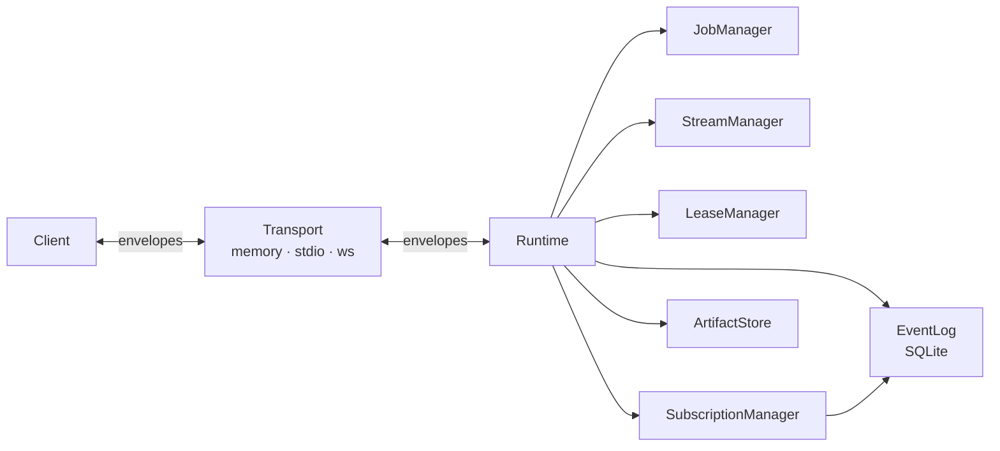

# ARCP F# SDK

F# reference implementation of the [Agent Runtime Control Protocol (ARCP) v1.0](./RFC-0001-v2.md). A typed, single-binary control plane for agent runtimes that owns the session, job, stream, subscription, lease, and human-in-the-loop machinery so applications stay out of message-routing.

  

## Status

v0.1.0 — reference implementation. Covers the core protocol surface (RFC §1–§19) end-to-end on the in-memory, stdio, and WebSocket transports. See [`CONFORMANCE.md`](./CONFORMANCE.md) for the per-section status table; v0.2 work (mTLS, OAuth2, multi-agent handoff, scheduled jobs, checkpoint resume, HTTP/2 + QUIC) is itemised there.

## Architecture



Every envelope flows through the runtime's send chokepoint: append to the event log, hand to the transport, fan out to matching observer subscriptions. The same fanout is what makes resume (RFC §19) and observer-mode (§13) work — they read from the same log.

## Run a sample in 60 seconds

```bash
dotnet run --project samples/01.MinimalSession            # session handshake (RFC §9)
dotnet run --project samples/02.ToolInvokeWithProgress    # job + progress (§10)
dotnet run --project samples/03.HumanInputRequest         # human-in-the-loop (§14)
dotnet run --project samples/04.PermissionChallenge       # permissions + leases (§15)
dotnet run --project samples/05.ObserverSubscription      # subscriptions (§13)
dotnet run --project samples/06.RelayHumanInTheLoop       # multi-channel human relay (§12.3)
```

Each sample wires a Runtime and a Client over `Memory.createPair ()` — no external services required.

## Install the CLI

The `arcp` command is published as a .NET global tool:

```bash
dotnet pack -c Release --output ./artifacts
dotnet tool install --global --add-source ./artifacts ARCP.FSharp.Cli
```

Then:

```bash
arcp --version                                                              # SDK + protocol version
arcp serve --stdio                                                          # NDJSON stdio runtime
arcp serve --ws --port 7878                                                 # WebSocket runtime on /ws
arcp send --url ws://127.0.0.1:7878/ws --token any --tool echo --args '"hi"'
arcp tail --url ws://127.0.0.1:7878/ws --token any                          # tail every envelope
arcp replay --session 01K... --db /path/to/events.db                        # replay the event log
```

When `--token` is omitted, `serve` accepts any non-empty bearer token (developer mode); set `ARCP_TOKEN=…` to lock it down without putting the secret in argv.

## RFC section → module map

| RFC | Topic | F# module |
| --- | --- | --- |
| §6 | Envelope | `src/ARCP/Envelope.fs` |
| §6.4 | Idempotency | `src/ARCP/Store/EventLog.fs` |
| §7 | Errors | `src/ARCP/Errors.fs` |
| §8 | Capabilities | `src/ARCP/Messages/Session.fs` |
| §9 | Session handshake | `src/ARCP/Runtime/Session.fs`, `Runtime.fs` |
| §10 | Jobs | `src/ARCP/Runtime/Job.fs` |
| §11 | Streams | `src/ARCP/Runtime/Stream.fs` |
| §12 | Cancellation & interrupt | `src/ARCP/Runtime/Job.fs` |
| §13 | Subscriptions | `src/ARCP/Runtime/Subscription.fs` |
| §14 | Human input | `src/ARCP/Runtime/Pending.fs`, `Runtime.fs` |
| §15 | Permissions & leases | `src/ARCP/Runtime/Lease.fs` |
| §16 | Artifacts | `src/ARCP/Runtime/Artifact.fs` |
| §17 | Trace context | `src/ARCP/Trace.fs` |
| §19 | Resume | `src/ARCP/Store/EventLog.fs`, `Runtime.fs` |
| §22 | Transports | `src/ARCP/Transport/{Memory,Stdio,WebSocket}.fs` |

## F#-specific notes

- **File order is architecture.** The `.fsproj` `<Compile Include="…" />` order is the dependency-first order of the SDK. A file may only reference types declared earlier; this catches layering mistakes at build time.
- **`task { … }` over `async { … }`.** All public async APIs return `Task` or `Task<T>` so consumers in C# or VB.NET get idiomatic types. The runtime/job/stream pumps are all `task` builders.
- **Single-case DUs for ids.** `SessionId`, `JobId`, `LeaseId`, etc. are newtypes — mixing them is a compile error. FSharp.SystemTextJson serialises them as their bare inner string.
- **Result<_, ARCPError>** is the return type for any code path that can produce a wire-level error. The runtime converts `Error e` from a tool handler into a `job.failed` envelope with the correct code; no exception escape required.

## Next steps

- See [`PLAN.md`](./PLAN.md) for the full build plan and phase log.
- See [`CONFORMANCE.md`](./CONFORMANCE.md) for the RFC section coverage table.
- See [`CHANGELOG.md`](./CHANGELOG.md) for release notes.
