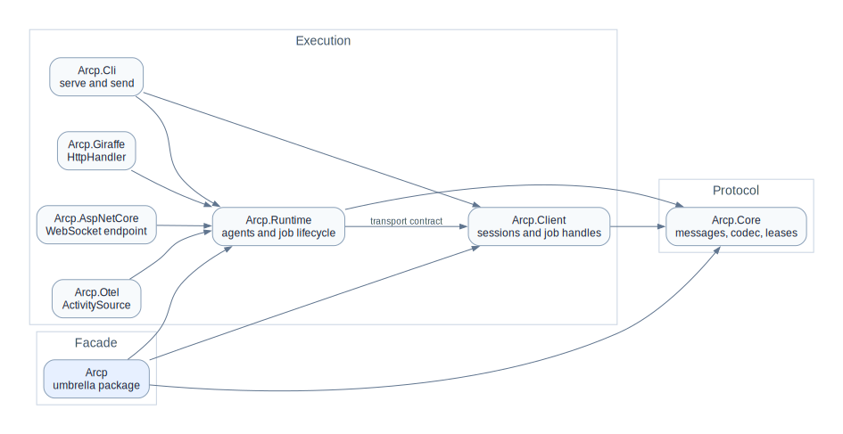

# ARCP F# SDK Docs

## Start here

- [Getting started](getting-started.md) — five-minute in-process demo
- [Architecture](architecture.md) — projects, wire format, design principles

<picture>
  <source media="(prefers-color-scheme: dark)" srcset="diagrams/architecture-dark.svg">
  <source media="(prefers-color-scheme: light)" srcset="diagrams/architecture-light.svg">
  
</picture>

## Guides

- [Sessions](guides/sessions.md) — handshake, heartbeat, resume (§6)
- [Auth](guides/auth.md) — bearer tokens, dev mode, custom verifiers (§6.1)
- [Resume](guides/resume.md) — reconnect without losing events (§6.3)
- [Jobs](guides/jobs.md) — submit, stream, cancel, idempotency (§7)
- [Job events](guides/job-events.md) — log, status, progress, artifacts, chunks (§8)
- [Leases](guides/leases.md) — capability grants, glob matching, budget (§9)
- [Delegation](guides/delegation.md) — child jobs and subset validation (§10)
- [Observability](guides/observability.md) — OpenTelemetry spans and trace propagation (§11)
- [Errors](guides/errors.md) — error codes, throwing, catching, retrying (§12)
- [Vendor extensions](guides/vendor-extensions.md) — `x-vendor.*` event kinds, types, capabilities (§15)

## Projects

- [Arcp](projects/Arcp.md) — umbrella re-export
- [Arcp.Core](projects/Arcp.Core.md) — wire types, codec, no I/O
- [Arcp.Client](projects/Arcp.Client.md) — `ArcpClient`, transports, auto-ack
- [Arcp.Runtime](projects/Arcp.Runtime.md) — `ArcpServer`, job lifecycle, lease validation
- [Arcp.AspNetCore](projects/Arcp.AspNetCore.md) — `MapArcp` endpoint extension
- [Arcp.Giraffe](projects/Arcp.Giraffe.md) — `useArcp` `HttpHandler`
- [Arcp.Otel](projects/Arcp.Otel.md) — `ActivitySource` and span attributes
- [Arcp.Cli](projects/Arcp.Cli.md) — `arcp serve` and `arcp send`

## Reference

- [CLI](cli.md) — full command reference
- [Transports](transports.md) — in-memory, stdio, WebSocket
- [Recipes](recipes.md) — common patterns
- [Conformance](conformance.md) — spec coverage summary
- [Troubleshooting](troubleshooting.md) — common errors and fixes
- [Diagrams](diagrams/README.md) — Graphviz sources and rendered SVGs (`architecture-light.dot`, `architecture-dark.dot`)
- [Root conformance document](../CONFORMANCE.md)
